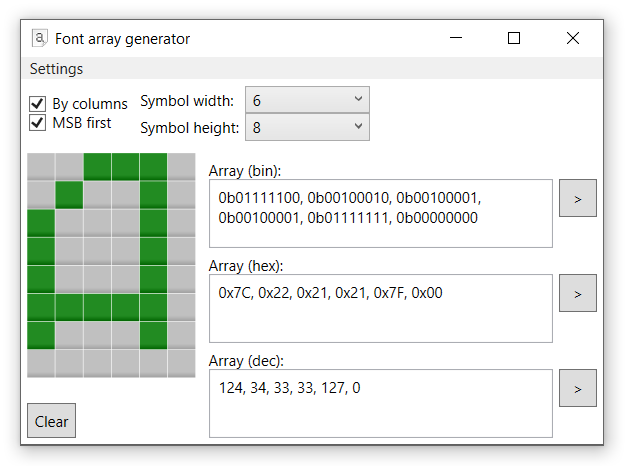

Generating byte arrays for LED panels, managing by microcontrollers (Arduino etc). Also, convert back from byte array to pixel symbol allowed.

## Features:
- Generating byte array for microcontroller for uploading to a LED matrix
- Conversion from byte array to symbol
- Changeable symbol dimensions
- Binary, hexadecimal and decimal presentation

Example of usage:

